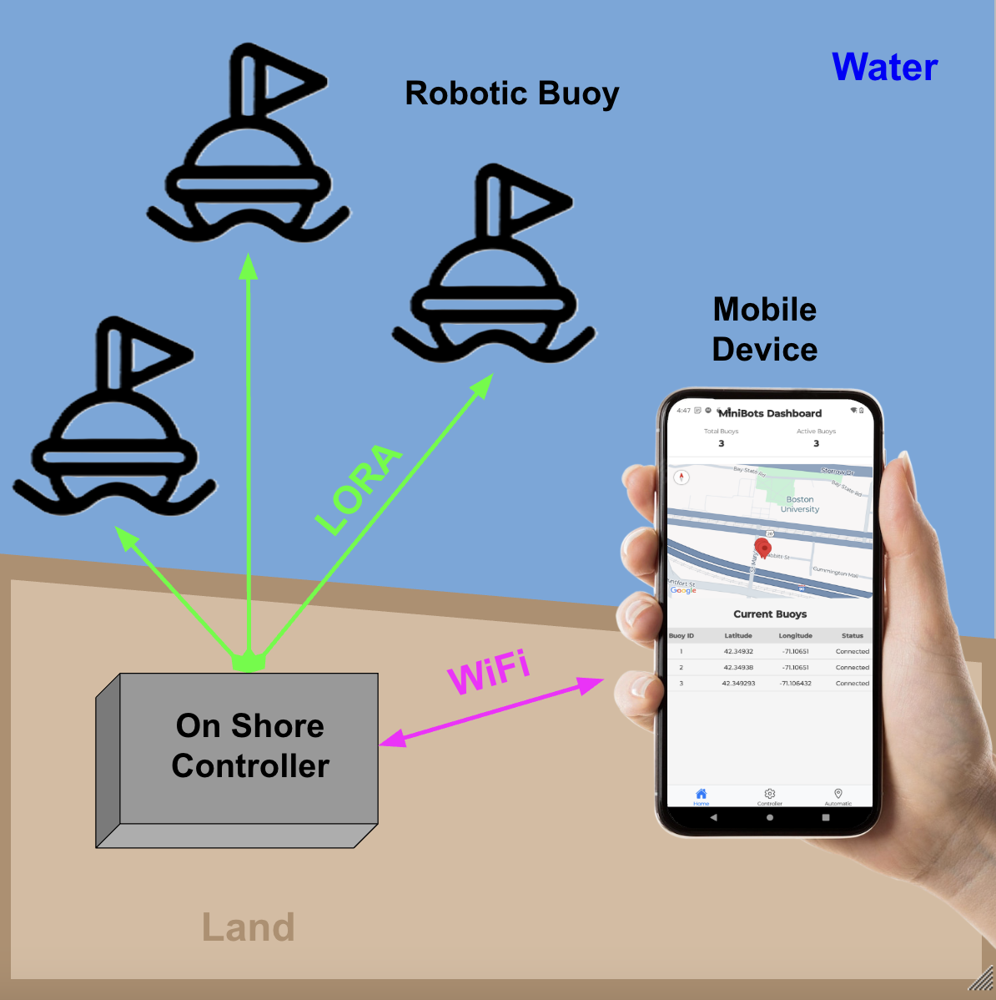

## MiniBots Senior Design Project 👋

---

### **MiniBots is revolutionizing the way courses are set for remote control sailboat racing.**

Traditionally, laying out courses with buoys and anchors is time-consuming and frustrating.

We’re solving this with **robotic, anchorless buoys** that empower sailors to set up and adjust their courses **more easily, accurately, and quickly** than ever before.

# Project Overview
## System Visualization

## 📱  Mobile App
The Mobile App is the heart part of the MiniBots system allowing sailors to easily view and control the buoys
<!-- - Multi Page React Native Application
- WebSockets for Real-Time Updates
- Live Map for Buoys Location -->

## 📡  On Shore Controller
The On Shore Controller has a number of functions including translating the Mobile App to Radio Messages to the Buoys. Additionally, the shore based controller acts as a database storing information about the system ranging from Number of Bots to Bot GPS Latitude/Longitude.

## 🤖  Robotic Buoy
These are battery powered floating robots that move and hold in place via two motors. Additionally they have a GPS and a compass to help it stay in place and know where it’s going. 

<!-- ## ⛵ Background 
A standard sailboat racecourse uses two buoys to define the start line and another to outline the turning point of the course. Traditionally, these buoys stay in place with a line and anchor.

Power boats are typically are used to place the the buoys at the beginning of the day and retrieve them afterward. Due to shifting winds, the buoys also often need to be moved in between races, which is tedious and time-consuming. -->

<!-- ## Problem 

## Solution  -->

